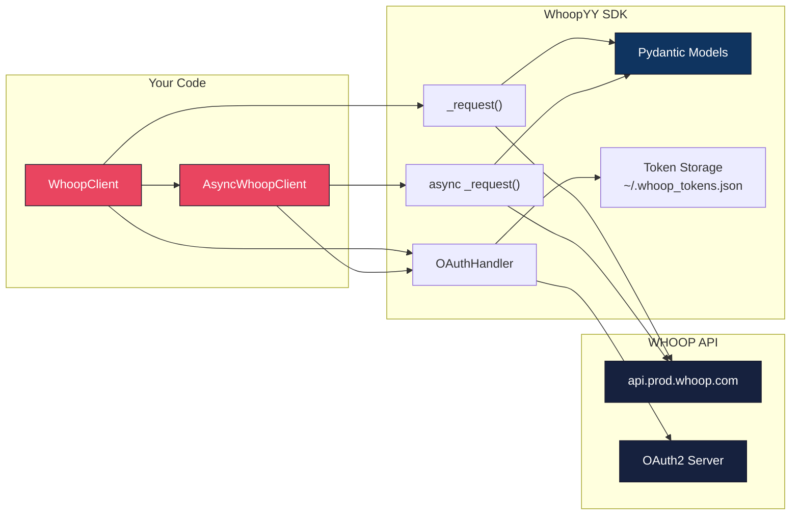
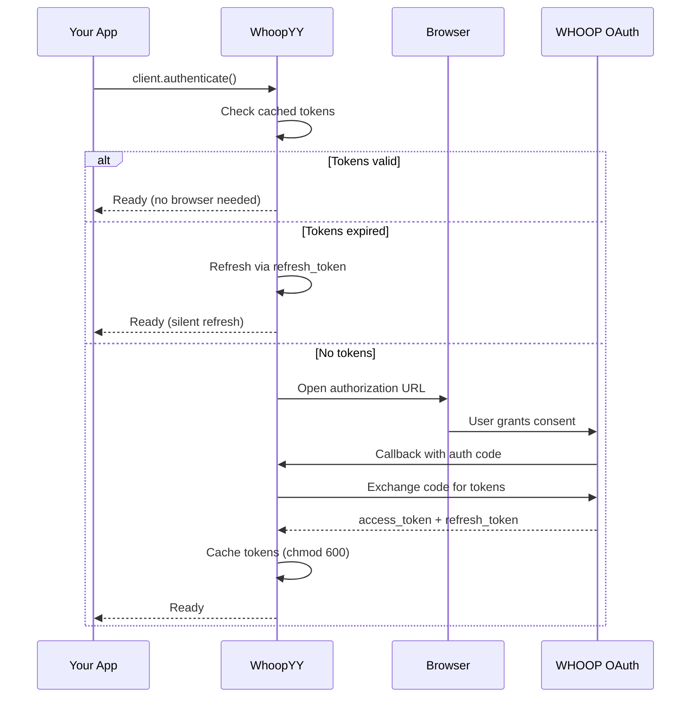
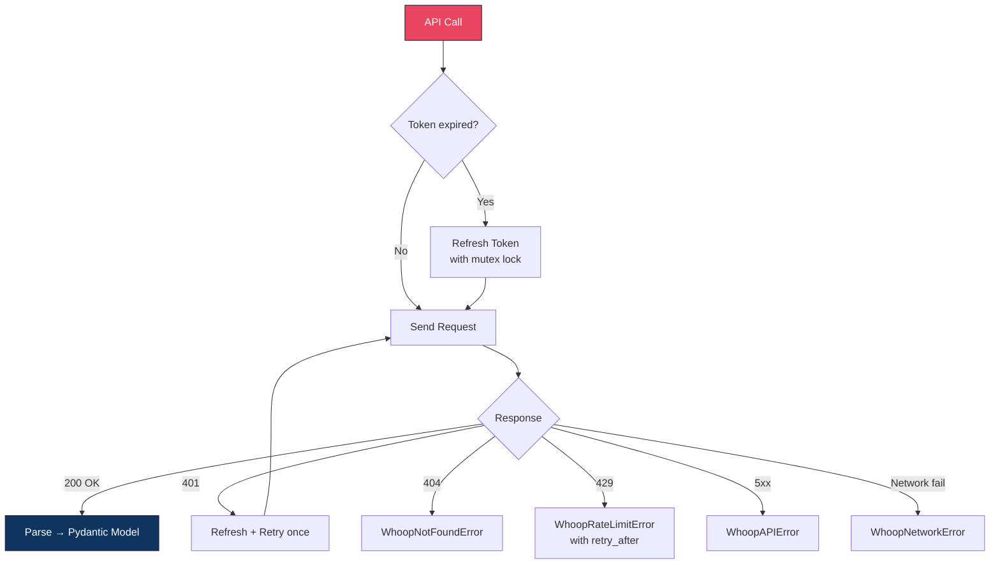
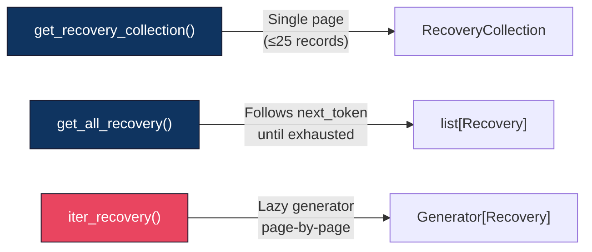
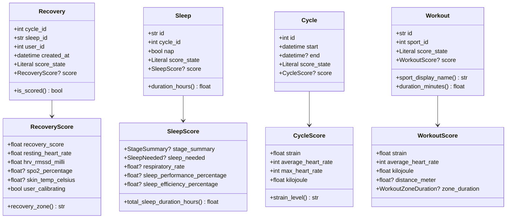
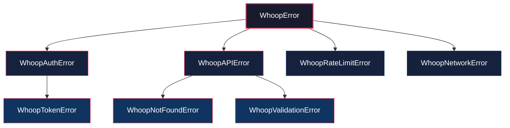

<div align="center">

<br>

```
 ██╗    ██╗██╗  ██╗ ██████╗  ██████╗ ██████╗ ██╗   ██╗██╗   ██╗
 ██║    ██║██║  ██║██╔═══██╗██╔═══██╗██╔══██╗╚██╗ ██╔╝╚██╗ ██╔╝
 ██║ █╗ ██║███████║██║   ██║██║   ██║██████╔╝ ╚████╔╝  ╚████╔╝
 ██║███╗██║██╔══██║██║   ██║██║   ██║██╔═══╝   ╚██╔╝    ╚██╔╝
 ╚███╔███╔╝██║  ██║╚██████╔╝╚██████╔╝██║        ██║      ██║
  ╚══╝╚══╝ ╚═╝  ╚═╝ ╚═════╝  ╚═════╝ ╚═╝        ╚═╝      ╚═╝
```

**The complete, type-safe Python SDK for the WHOOP API**

[](https://www.python.org)
[](https://docs.pydantic.dev)
[](https://docs.python.org/3/library/asyncio.html)
[](http://mypy-lang.org)

<br>

*Recovery scores. Sleep stages. Strain data. Workouts.*
*All type-safe, all auto-paginated, all with zero token headaches.*

<br>

</div>

---

```python
from whoopyy import WhoopClient

with WhoopClient(client_id="...", client_secret="...") as client:
    client.authenticate()

    for r in client.get_recovery_collection(limit=7).records:
        if r.score:
            zone = r.score.recovery_zone  # "green" | "yellow" | "red"
            print(f"  {r.created_at:%b %d}  {r.score.recovery_score:5.1f}%  HRV {r.score.hrv_rmssd_milli:.0f}ms  [{zone}]")
```

```
  Mar 13   82.0%  HRV 68ms  [green]
  Mar 12   45.3%  HRV 31ms  [yellow]
  Mar 11   71.8%  HRV 55ms  [green]
  Mar 10   28.1%  HRV 22ms  [red]
```

---

## Table of Contents

- [Install](#install)
- [Quick Start](#quick-start)
- [Architecture](#architecture)
- [API Coverage](#api-coverage)
- [Authentication](#authentication)
- [Data Retrieval](#data-retrieval)
- [Pagination](#pagination)
- [Async Client](#async-client)
- [Data Models](#data-models)
- [Export & Analysis](#export--analysis)
- [Error Handling](#error-handling)
- [Security](#security)
- [Development](#development)

---

## Install

```bash
pip install whoopyy
```

```bash
# From source
git clone https://github.com/ponderrr/whoopyy.git
cd whoopyy && pip install -e .
```

> **Requirements:** Python 3.9+ &mdash; only two dependencies: [`httpx`](https://www.python-httpx.org/) and [`pydantic`](https://docs.pydantic.dev/) v2

---

## Quick Start

**1.** Register at [developer.whoop.com](https://developer.whoop.com) and create an application

**2.** Set your redirect URI to `http://localhost:8080/callback`

**3.** Run:

```python
from whoopyy import WhoopClient

client = WhoopClient(
    client_id="your_client_id",
    client_secret="your_client_secret",
)
client.authenticate()   # opens browser, caches tokens for next time

# You're in.
profile = client.get_profile_basic()
print(f"Hello, {profile.first_name} {profile.last_name}")
```

---

## Architecture



### OAuth Flow



### Request Lifecycle



---

## API Coverage

Full coverage of every WHOOP developer API endpoint:

| Endpoint | Single | Collection | Auto-paginate | Generator |
|:---------|:------:|:----------:|:-------------:|:---------:|
| **Profile** | `get_profile_basic()` | — | — | — |
| **Body** | `get_body_measurement()` | — | — | — |
| **Recovery** | `get_recovery_for_cycle()` | `get_recovery_collection()` | `get_all_recovery()` | `iter_recovery()` |
| **Sleep** | `get_sleep()` | `get_sleep_collection()` | `get_all_sleep()` | `iter_sleep()` |
| **Cycles** | `get_cycle()` | `get_cycle_collection()` | `get_all_cycles()` | `iter_cycles()` |
| **Workouts** | `get_workout()` | `get_workout_collection()` | `get_all_workouts()` | `iter_workouts()` |
| **Access** | `revoke_access()` | — | — | — |

> All collection methods accept `start`, `end` (datetime filtering), `limit` (max 25), and `next_token` (pagination cursor).

---

## Authentication

```python
client = WhoopClient(
    client_id="...",
    client_secret="...",
    redirect_uri="http://localhost:8080/callback",  # default
    token_file="~/.whoop_tokens.json",              # default, absolute path
    timeout=30.0,                                    # request timeout in seconds
)

client.authenticate()
# First run: opens browser for OAuth consent
# Subsequent runs: loads cached tokens, refreshes if expired
```

The SDK handles the complete OAuth 2.0 lifecycle automatically:
- **CSRF protection** via cryptographic `state` parameter
- **Proactive token refresh** before expiry (60s buffer)
- **Thread-safe refresh** with `threading.Lock` (sync) and `asyncio.Lock` (async)
- **Automatic 401 retry** — refreshes token and replays the failed request once
- **5xx retry on refresh** — exponential backoff on transient token server errors
- **Secure storage** — token file created with `chmod 600`

---

## Data Retrieval

### Recovery

```python
# Latest 7 days
recovery = client.get_recovery_collection(limit=7)
for r in recovery.records:
    if r.score:
        print(f"{r.score.recovery_score:.0f}% | "
              f"HRV: {r.score.hrv_rmssd_milli:.0f}ms | "
              f"RHR: {r.score.resting_heart_rate:.0f}bpm | "
              f"Zone: {r.score.recovery_zone}")

# Single recovery by cycle ID
recovery = client.get_recovery_for_cycle(cycle_id=12345)
```

### Sleep

```python
sleep_data = client.get_sleep_collection(limit=7)
for s in sleep_data.records:
    if s.score:
        hours = s.score.total_sleep_duration_hours
        perf = s.score.sleep_performance_percentage or 0
        print(f"{'Nap' if s.nap else 'Sleep'}: {hours:.1f}h | Performance: {perf:.0f}%")

# Single sleep by UUID
sleep = client.get_sleep(sleep_id="abc-123-def")
```

### Cycles (Daily Strain)

```python
cycles = client.get_cycle_collection(limit=7)
for c in cycles.records:
    if c.score:
        print(f"Strain: {c.score.strain:.1f}/21 | "
              f"Level: {c.score.strain_level} | "
              f"Max HR: {c.score.max_heart_rate}bpm")
```

### Workouts

```python
workouts = client.get_workout_collection(limit=10)
for w in workouts.records:
    if w.score:
        print(f"{w.sport_display_name}: {w.duration_minutes:.0f}min | "
              f"Strain: {w.score.strain:.1f} | "
              f"Calories: {w.score.kilojoule:.0f}kJ")
```

### Profile

```python
profile = client.get_profile_basic()
body = client.get_body_measurement()

print(f"{profile.full_name}")
print(f"Max HR: {body.max_heart_rate}bpm")
```

### Date Filtering

```python
from datetime import datetime, timedelta

# Last 30 days
end = datetime.now()
start = end - timedelta(days=30)
data = client.get_recovery_collection(start=start, end=end)
```

---

## Pagination

Three strategies, from simple to streaming:

```python
# 1. Single page (manual)
page = client.get_recovery_collection(limit=25)
# page.next_token → pass to next call for manual pagination

# 2. Auto-paginate everything into a list
all_records = client.get_all_recovery(max_records=200)

# 3. Memory-efficient generator (best for large datasets)
for recovery in client.iter_recovery(start=start, end=end):
    process(recovery)  # yields one at a time, fetches pages lazily
```



---

## Async Client

Drop-in replacement for concurrent data fetching:

```python
import asyncio
from whoopyy import AsyncWhoopClient

async def build_dashboard():
    async with AsyncWhoopClient(client_id="...", client_secret="...") as client:
        client.authenticate()

        # Fetch everything concurrently — 4 requests, 1 round-trip
        profile, recovery, sleep, workouts = await asyncio.gather(
            client.get_profile_basic(),
            client.get_recovery_collection(limit=7),
            client.get_sleep_collection(limit=7),
            client.get_workout_collection(limit=10),
        )

        print(f"Welcome back, {profile.first_name}")
        for r in recovery.records:
            if r.score:
                print(f"  Recovery: {r.score.recovery_score:.0f}%")

asyncio.run(build_dashboard())
```

The async client uses non-blocking token refresh (`asyncio.Lock` + `httpx.AsyncClient`) so concurrent requests never block the event loop.

---

## Data Models

All models are **immutable** Pydantic v2 objects (`frozen=True`) with full type annotations and computed properties.



### score_state

Every entity uses a `Literal` type for scoring status:

| State | Meaning |
|:------|:--------|
| `SCORED` | Score is available in `.score` |
| `PENDING_SCORE` | WHOOP is still calculating |
| `UNSCORABLE` | Not enough data to score |

> Always check `if record.score:` before accessing score fields.

### Computed Properties

| Model | Property | Returns |
|:------|:---------|:--------|
| `RecoveryScore` | `.recovery_zone` | `"green"` / `"yellow"` / `"red"` |
| `CycleScore` | `.strain_level` | `"Light"` / `"Moderate"` / `"Strenuous"` / `"All Out"` |
| `Sleep` | `.duration_hours` | Total sleep duration as `float` |
| `Workout` | `.sport_display_name` | Human-readable sport name from `sport_id` |
| `Workout` | `.duration_minutes` | Workout duration as `float` |
| `UserProfileBasic` | `.full_name` | `"First Last"` |
| `BodyMeasurement` | `.height_feet` / `.weight_pounds` | Imperial conversions |

---

## Export & Analysis

### CSV Export

```python
from whoopyy import (
    export_recovery_csv,
    export_sleep_csv,
    export_cycle_csv,
    export_workout_csv,
)

recoveries = client.get_all_recovery(max_records=90)
export_recovery_csv(recoveries, "recovery_q1.csv")

sleeps = client.get_all_sleep(max_records=90)
export_sleep_csv(sleeps, "sleep_q1.csv")
```

### Trend Analysis

```python
from whoopyy import analyze_recovery_trends, analyze_sleep_trends, analyze_training_load

# Recovery
trends = analyze_recovery_trends(recoveries)
print(f"Avg Recovery:  {trends.average_score:.1f}%")
print(f"HRV Stability: {trends.hrv_coefficient_of_variation:.1f}% CV")
print(f"Green Days:    {trends.green_days}/{trends.record_count}")

# Sleep
sleep_trends = analyze_sleep_trends(sleeps)
print(f"Avg Duration:  {sleep_trends.average_duration_hours:.1f}h")

# Training load
load = analyze_training_load(cycles, workouts)
print(f"Weekly Strain:  {load.total_strain:.1f}")

# Full report
from whoopyy import generate_summary_report
generate_summary_report(recoveries, sleeps, cycles, workouts, output="report.txt")
```

---

## Error Handling

### Exception Hierarchy



| Exception | When | Retryable? |
|:----------|:-----|:----------:|
| `WhoopAuthError` | OAuth failure, invalid credentials | No — re-authenticate |
| `WhoopTokenError` | Token refresh failure | No — re-authenticate |
| `WhoopNotFoundError` | Resource not found (404) | No |
| `WhoopValidationError` | Bad request params (400) | No — fix request |
| `WhoopRateLimitError` | Rate limited (429) | Yes — use `.retry_after` |
| `WhoopNetworkError` | DNS, timeout, connection | Yes — backoff |
| `WhoopAPIError` | Other HTTP errors | 5xx yes, 4xx no |

```python
from whoopyy.exceptions import (
    WhoopRateLimitError,
    WhoopAuthError,
    WhoopNetworkError,
    is_retryable_error,
)

try:
    data = client.get_recovery_collection()

except WhoopRateLimitError as e:
    time.sleep(e.retry_after)  # respect the rate limit

except WhoopAuthError:
    client.authenticate()  # full re-auth

except WhoopNetworkError:
    retry_with_backoff()  # transient failure

except WhoopError as e:
    if is_retryable_error(e):
        retry_with_backoff()
    else:
        raise
```

### Built-in Resilience

The SDK handles common failure modes automatically:

| Scenario | SDK Behavior |
|:---------|:-------------|
| Token expires mid-request | Refreshes token + retries the request once |
| Two threads refresh simultaneously | Mutex ensures only one refresh fires |
| Token server returns 503 | Retries up to 3x with exponential backoff |
| User never completes OAuth | Callback server times out after 120s |

---

## Security

| Concern | How WhoopYY handles it |
|:--------|:-----------------------|
| Token storage | `~/.whoop_tokens.json` with `chmod 600` (owner-only) |
| CSRF protection | Cryptographic `state` parameter on every OAuth flow |
| Token refresh | Thread-safe with locking, prevents double-refresh corruption |
| Secrets in code | Tokens never logged; pass credentials via env vars |

```bash
# Recommended: use environment variables
export WHOOP_CLIENT_ID="your_id"
export WHOOP_CLIENT_SECRET="your_secret"
```

```python
import os
from whoopyy import WhoopClient

client = WhoopClient(
    client_id=os.environ["WHOOP_CLIENT_ID"],
    client_secret=os.environ["WHOOP_CLIENT_SECRET"],
)
```

> **Do not** commit `~/.whoop_tokens.json` to version control. The SDK stores access and refresh tokens as plaintext JSON.

---

## Development

```bash
# Setup
git clone https://github.com/ponderrr/whoopyy.git
cd whoopyy
pip install -e ".[dev]"

# Test
pytest                                            # run all tests
pytest --cov=whoopyy --cov-report=term-missing    # with coverage
pytest tests/test_auth.py -v                       # specific module

# Type check
mypy src/ --ignore-missing-imports

# Build
python -m build
```

### Project Structure

```
whoopyy/
├── src/
│   ├── __init__.py          # Public API surface
│   ├── auth.py              # OAuth 2.0 handler with token lifecycle
│   ├── client.py            # Sync client (WhoopClient)
│   ├── async_client.py      # Async client (AsyncWhoopClient)
│   ├── models.py            # Pydantic v2 data models
│   ├── exceptions.py        # Typed exception hierarchy
│   ├── constants.py         # API endpoints, limits, config
│   ├── export.py            # CSV export + trend analysis
│   ├── utils.py             # Token I/O, datetime helpers
│   ├── logger.py            # Structured logging config
│   └── type_defs.py         # TypedDict definitions
├── tests/                   # 360+ tests, 90% coverage
├── examples/                # Usage examples
├── setup.py
└── pyproject.toml
```

---

## License

Proprietary &mdash; All Rights Reserved. See [LICENSE](LICENSE).

---

<div align="center">

<br>

**[Documentation](https://github.com/ponderrr/whoopyy)** &nbsp;&middot;&nbsp; **[Report a Bug](https://github.com/ponderrr/whoopyy/issues)** &nbsp;&middot;&nbsp; **[API Docs](https://developer.whoop.com)**

<br>

<sub>This is an unofficial SDK. WHOOP is a registered trademark of WHOOP, Inc.</sub>

<br>

</div>
