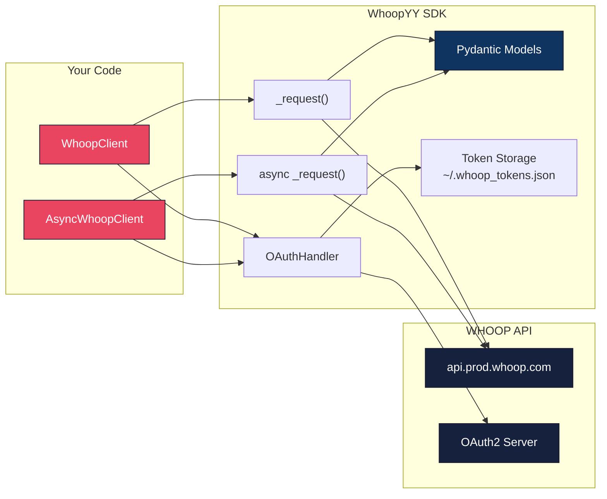
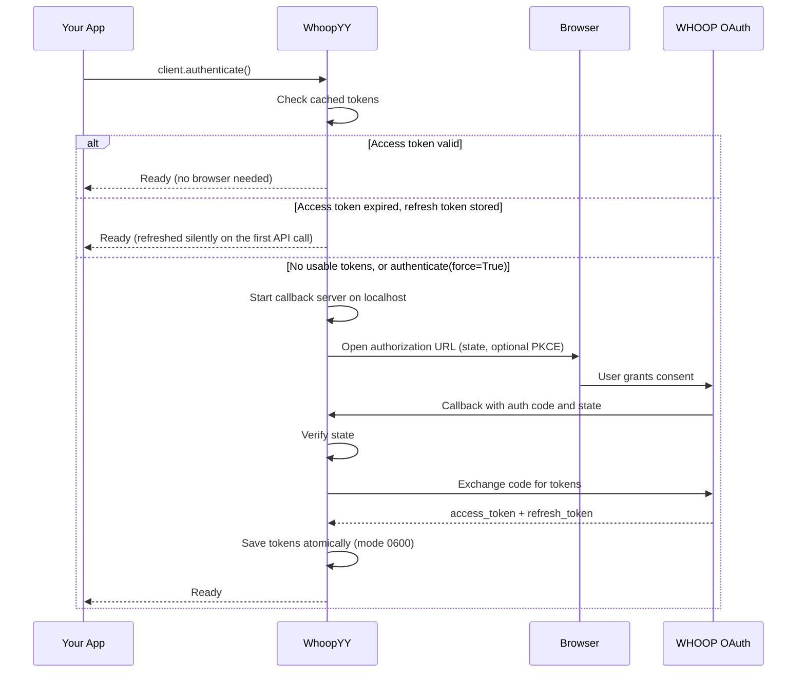
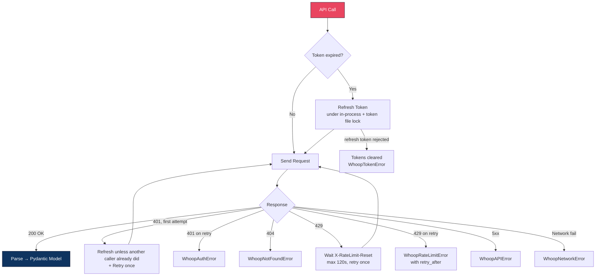
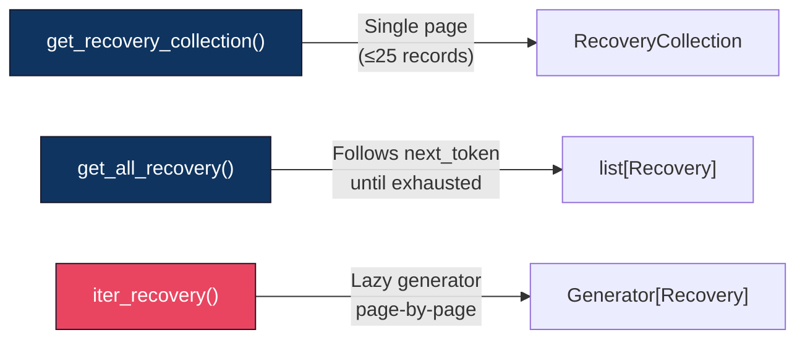
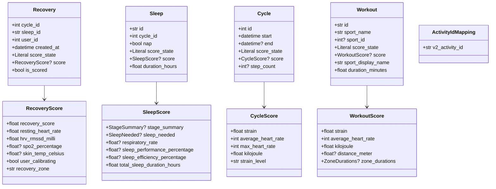
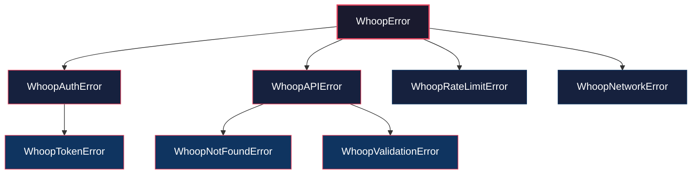

<div align="center">

<br>

```
 ██╗    ██╗██╗  ██╗ ██████╗  ██████╗ ██████╗ ██╗   ██╗██╗   ██╗
 ██║    ██║██║  ██║██╔═══██╗██╔═══██╗██╔══██╗╚██╗ ██╔╝╚██╗ ██╔╝
 ██║ █╗ ██║███████║██║   ██║██║   ██║██████╔╝ ╚████╔╝  ╚████╔╝ 
 ██║███╗██║██╔══██║██║   ██║██║   ██║██╔═══╝   ╚██╔╝    ╚██╔╝  
 ╚███╔███╔╝██║  ██║╚██████╔╝╚██████╔╝██║        ██║      ██║   
  ╚══╝╚══╝ ╚═╝  ╚═╝ ╚═════╝  ╚═════╝ ╚═╝        ╚═╝      ╚═╝   
```

**The complete, type-safe Python SDK for the WHOOP API**

[](https://www.python.org)
[](https://docs.pydantic.dev)
[](https://docs.python.org/3/library/asyncio.html)
[](https://mypy-lang.org)

<br>

*Recovery scores. Sleep stages. Strain data. Workouts.*<br>
*All type-safe, all auto-paginated, all with zero token headaches.*

<br>

</div>

---

```python
from whoopyy import WhoopClient

with WhoopClient(client_id="...", client_secret="...") as client:
    client.authenticate()

    for r in client.get_recovery_collection(limit=7).records:
        if r.score:
            zone = r.score.recovery_zone  # "green" | "yellow" | "red"
            print(f"  {r.created_at:%b %d}  {r.score.recovery_score:5.1f}%  HRV {r.score.hrv_rmssd_milli:.0f}ms  [{zone}]")
```

```
  Mar 13   82.0%  HRV 68ms  [green]
  Mar 12   45.3%  HRV 31ms  [yellow]
  Mar 11   71.8%  HRV 55ms  [green]
  Mar 10   28.1%  HRV 22ms  [red]
```

<sub>whoopyy also writes INFO log lines to stderr by default; set `WHOOPYY_LOG_LEVEL=WARNING` to see only the output above.</sub>

---

## Table of Contents

- [Install](#install)
- [Quick Start](#quick-start)
- [Architecture](#architecture)
- [API Coverage](#api-coverage)
- [Authentication](#authentication)
- [Data Retrieval](#data-retrieval)
- [Pagination](#pagination)
- [Async Client](#async-client)
- [Data Models](#data-models)
- [Export & Analysis](#export--analysis)
- [Error Handling](#error-handling)
- [Security](#security)
- [Development](#development)

---

## Install

```bash
pip install whoopyy
```

```bash
# From source
git clone https://github.com/ponderrr/whoopyy.git
cd whoopyy && pip install -e .
```

> **Requirements:** Python 3.9+ &mdash; only two dependencies: [`httpx`](https://www.python-httpx.org/) and [`pydantic`](https://docs.pydantic.dev/) v2

> **Upgrading from 0.2.x / 0.3.x (installed from GitHub)?** WHOOP has retired its v1 API, and versions 0.2.0&ndash;0.3.1 send their data calls to v1 paths. 0.4.0 targets the **WHOOP Developer API v2**. It has breaking changes (`zone_duration` &rarr; `zone_durations`, `sport_id` may be `None`, `revoke_access()` now calls `DELETE /developer/v2/user/access`). See the [CHANGELOG](https://github.com/ponderrr/whoopyy/blob/main/CHANGELOG.md#040---2026-10-06) for the migration notes.

---

## Quick Start

**1.** Register at [developer.whoop.com](https://developer.whoop.com) and create an application

**2.** Set your redirect URI to `http://localhost:8080/callback`

**3.** Run:

```python
from whoopyy import WhoopClient

client = WhoopClient(
    client_id="your_client_id",
    client_secret="your_client_secret",
)
client.authenticate()   # opens browser, caches tokens for next time

# You're in.
profile = client.get_profile_basic()
print(f"Hello, {profile.first_name} {profile.last_name}")
```

---

## Architecture

> The diagrams in this README are Mermaid. They render on [GitHub](https://github.com/ponderrr/whoopyy#architecture); PyPI shows their source.

`WhoopClient` and `AsyncWhoopClient` are independent of each other. Each has its own `OAuthHandler`, which keeps the tokens in the token file and refreshes them, and its own HTTP client for `api.prod.whoop.com`. Responses are parsed into Pydantic models.


```mermaid
graph LR
    subgraph Your Code
        A[WhoopClient]
        B[AsyncWhoopClient]
    end

    subgraph WhoopYY SDK
        A --> C[OAuthHandler]
        B --> C
        A --> D["_request()"]
        B --> E["async _request()"]
        D --> F[Pydantic Models]
        E --> F
        C --> G[Token Storage<br>~/.whoop_tokens.json]
    end

    subgraph WHOOP API
        D --> H[api.prod.whoop.com]
        E --> H
        C --> I[OAuth2 Server]
    end

    style A fill:#e94560,stroke:#1a1a2e,color:#fff
    style B fill:#e94560,stroke:#1a1a2e,color:#fff
    style F fill:#0f3460,stroke:#1a1a2e,color:#fff
    style H fill:#16213e,stroke:#1a1a2e,color:#fff
    style I fill:#16213e,stroke:#1a1a2e,color:#fff
```

### OAuth Flow


```mermaid
sequenceDiagram
    participant App as Your App
    participant SDK as WhoopYY
    participant Browser as Browser
    participant Whoop as WHOOP OAuth

    App->>SDK: client.authenticate()
    SDK->>SDK: Check cached tokens

    alt Access token valid
        SDK-->>App: Ready (no browser needed)
    else Access token expired, refresh token stored
        SDK-->>App: Ready (refreshed silently on the first API call)
    else No usable tokens, or authenticate(force=True)
        SDK->>SDK: Start callback server on localhost
        SDK->>Browser: Open authorization URL (state, optional PKCE)
        Browser->>Whoop: User grants consent
        Whoop->>SDK: Callback with auth code and state
        SDK->>SDK: Verify state
        SDK->>Whoop: Exchange code for tokens
        Whoop-->>SDK: access_token + refresh_token
        SDK->>SDK: Save tokens atomically (mode 0600)
        SDK-->>App: Ready
    end
```

### Request Lifecycle


```mermaid
flowchart TD
    A[API Call] --> B{Token expired?}
    B -->|No| D[Send Request]
    B -->|Yes| C[Refresh Token<br>under in-process + token file lock]
    C --> D
    C -->|refresh token rejected| M[Tokens cleared<br>WhoopTokenError]

    D --> E{Response}
    E -->|200 OK| F[Parse → Pydantic Model]
    E -->|401, first attempt| G[Refresh unless another caller already did<br>+ Retry once]
    E -->|401 on retry| N[WhoopAuthError]
    E -->|404| H[WhoopNotFoundError]
    E -->|429| I[Wait X-RateLimit-Reset<br>max 120s, retry once]
    E -->|429 on retry| L[WhoopRateLimitError<br>with retry_after]
    E -->|5xx| J[WhoopAPIError]
    E -->|Network fail| K[WhoopNetworkError]
    G --> D
    I --> D

    style A fill:#e94560,stroke:#1a1a2e,color:#fff
    style F fill:#0f3460,stroke:#1a1a2e,color:#fff
```

---

## API Coverage

Full coverage of every user-data endpoint in the **WHOOP Developer API v2** (the healthcare partner API under `/v2/partner` is not covered):

| Endpoint | Single | Collection | Auto-paginate | Generator |
|:---------|:------:|:----------:|:-------------:|:---------:|
| **Profile** | `get_profile_basic()` | — | — | — |
| **Body** | `get_body_measurement()` | — | — | — |
| **Recovery** | `get_recovery_for_cycle()` | `get_recovery_collection()` | `get_all_recovery()` | `iter_recovery()` |
| **Sleep** | `get_sleep()`<br>`get_sleep_for_cycle()` | `get_sleep_collection()` | `get_all_sleep()` | `iter_sleep()` |
| **Cycles** | `get_cycle()` | `get_cycle_collection()` | `get_all_cycles()` | `iter_cycles()` |
| **Workouts** | `get_workout()` | `get_workout_collection()` | `get_all_workouts()` | `iter_workouts()` |
| **ID Mapping** | `get_activity_mapping()` | — | — | — |
| **Access** | `revoke_access()` | — | — | — |

> All collection methods accept `start` (inclusive), `end` (exclusive), `limit` (max 25), and `next_token` (pagination cursor). `start`/`end` take a `datetime`, a `date`, or an ISO 8601 string. A bare `"YYYY-MM-DD"` string is sent as midnight UTC, because v2 rejects date-only values.

### Endpoint Reference

Paths are relative to `https://api.prod.whoop.com`. Sleep and workout IDs are UUID strings; cycle IDs are integers.

| Method | HTTP | Path |
|:-------|:----:|:-----|
| `get_profile_basic()` | `GET` | `/developer/v2/user/profile/basic` |
| `get_body_measurement()` | `GET` | `/developer/v2/user/measurement/body` |
| `revoke_access()` | `DELETE` | `/developer/v2/user/access` |
| `get_recovery_collection()` | `GET` | `/developer/v2/recovery` |
| `get_recovery_for_cycle(cycle_id)` | `GET` | `/developer/v2/cycle/{cycle_id}/recovery` |
| `get_sleep(sleep_id)` | `GET` | `/developer/v2/activity/sleep/{sleep_id}` |
| `get_sleep_collection()` | `GET` | `/developer/v2/activity/sleep` |
| `get_sleep_for_cycle(cycle_id)` | `GET` | `/developer/v2/cycle/{cycle_id}/sleep` |
| `get_cycle(cycle_id)` | `GET` | `/developer/v2/cycle/{cycle_id}` |
| `get_cycle_collection()` | `GET` | `/developer/v2/cycle` |
| `get_workout(workout_id)` | `GET` | `/developer/v2/activity/workout/{workout_id}` |
| `get_workout_collection()` | `GET` | `/developer/v2/activity/workout` |
| `get_activity_mapping(activity_v1_id)` | `GET` | `/developer/v1/activity-mapping/{activity_v1_id}` |

> The activity-mapping lookup is the only v1 path WHOOP still documents. It exists to translate legacy v1 integer sleep/workout IDs into v2 UUIDs.

---

## Authentication

```python
import os

client = WhoopClient(
    client_id="...",
    client_secret="...",
    redirect_uri="http://localhost:8080/callback",          # default
    token_file=os.path.expanduser("~/.whoop_tokens.json"),  # default; pass a full path, "~" is not expanded
    timeout=30.0,                                           # seconds, for API and token requests (API connect capped at 5s)
    use_pkce=False,                                         # default; True adds a PKCE (S256) challenge
)

client.authenticate()
# First run: opens browser for OAuth consent
# Subsequent runs: uses the cached tokens; an expired access token is refreshed on the first API call
```

The SDK handles the complete OAuth 2.0 lifecycle automatically:
- **CSRF protection** via a cryptographic `state` parameter, checked before the callback's code or error is used
- **Proactive token refresh** before expiry (60s buffer)
- **One refresh at a time** — WHOOP rotates the refresh token on every refresh, so a used refresh token never works again. Each refresh holds an in-process lock (`threading.RLock` for sync code, an `asyncio.Lock` per event loop for async code) and then a cross-process lock on `<token_file>.lock`, and re-reads the token file first. Threads, coroutines, clients and processes that share a token file therefore refresh once and reuse the result
- **Automatic 401 retry** — refreshes the token (unless another thread, coroutine or process has already replaced the rejected one) and replays the failed request once
- **5xx retry on refresh** — exponential backoff on transient token server errors. Threads and coroutines of the same client that were waiting for a refresh that fails get its error instead of repeating it (other clients and processes sharing the token file try the refresh themselves)
- **Dead refresh token handling** — if WHOOP rejects the stored refresh token (`invalid_grant` or `token_inactive`), the SDK re-reads the token file in case another process rotated it. If it did not, the SDK clears the in-memory tokens, deletes the token file and raises `WhoopTokenError` ("WHOOP authorization has ended..."). Calls waiting for that refresh, and later calls, get the same error, and the next `authenticate()` opens the browser again. If the token file cannot be deleted, the message says so and the handler ignores the file's contents
- **Secure storage** — the token file is written atomically (temp file, fsync, rename) with mode `0600`, even if it already existed with looser permissions. A symlink at the token path is refused
- **No lost refresh tokens** — before a refresh token or an authorization code is sent, the SDK checks that the token file can be written (and is not a symlink). If it cannot, `WhoopTokenError` (or `WhoopAuthError` from `authenticate()`) is raised and nothing is sent, so the stored refresh token stays valid. An async refresh runs in its own task, so cancelling the request that started it (`asyncio.wait_for`, a client disconnect) does not lose the rotated token

### Re-authenticating and Signing Out

```python
client.authenticate(force=True)   # run the browser flow even though tokens are stored
client.logout()                   # forget the tokens locally; WHOOP is not contacted
```

`authenticate()` skips the browser while usable tokens are stored: an unexpired access token, or a refresh token. Use `force=True` to sign in again anyway, for example to switch accounts or grant new scopes. A completed browser flow also clears the response cache.

`logout()` clears the in-memory tokens, deletes the token file and clears the response cache. `is_authenticated()` then returns `False`, and the next `authenticate()` runs the OAuth flow again. The grant stays valid on WHOOP's side; use `revoke_access()` to revoke it. On `AsyncWhoopClient`, `logout()` is a coroutine (`await client.logout()`).

### PKCE (opt-in)

`use_pkce=True` (on `WhoopClient`, `AsyncWhoopClient` or `OAuthHandler`) sends an S256 `code_challenge` in the authorization URL and the matching `code_verifier` with the code exchange, alongside the client secret. A new verifier is generated for every flow. It is off by default until it has been verified against WHOOP's OAuth server.

### The Callback Server

`authorize()` starts a local HTTP server on the redirect URI's port before it opens the browser. The redirect host must be `localhost`, `127.0.0.1` or `[::1]`. For `127.0.0.1` and `[::1]` the server listens on that address. For `localhost` it listens on both `127.0.0.1` and `::1` (where the machine has IPv6), because browsers may resolve `localhost` to either. If another program already accepts connections on one of those addresses and the port (for example a dev server on `[::]:8080`), `WhoopAuthError` is raised before the browser opens, so that program cannot receive the authorization code. A `http://127.0.0.1:PORT/...` redirect URI (RFC 8252, section 8.3) avoids the `localhost` ambiguity altogether.

The server only accepts a request to the redirect URI's path that carries the expected `state`. Other paths get a 404 and a wrong or missing `state` gets a 400, and in both cases the server keeps waiting. Text echoed into the page is HTML-escaped. The flow gives up after 120 seconds. Each connection has a 10-second read timeout and is closed after 10 seconds at most, at most 16 are open at once (a new one closes the oldest), and all are closed when the flow ends, so idle or trickling connections cannot hold up the flow or leave threads behind.

### Sharing a Token File

Any number of threads, `WhoopClient`/`AsyncWhoopClient` instances and processes can use the same token file. The SDK creates a lock file `<token_file>.lock` (mode `0600`) next to it and never deletes it, not even on `logout()`. Locking uses `fcntl.flock` on POSIX and `msvcrt.locking` on Windows.

The token file's directory should be writable by the process. If it is not, but the token file itself is, the SDK rewrites the file in place (not atomically, with a warning) and runs without the cross-process lock, because the lock file cannot be created there (also logged as a warning). The same in-place rewrite is used when the token file is a mount point, such as a Docker single-file bind mount. If neither the directory nor the file is writable, refreshing raises `WhoopTokenError` before the refresh token is sent.

In async code, use `AsyncWhoopClient`. If synchronous token code runs on the event loop's thread while an async refresh on the same token file is in progress there, it raises `RuntimeError` instead of deadlocking, and `authenticate()` raises `WhoopAuthError` before opening the browser. Call `authenticate()` before starting async work, or in a worker thread (`await asyncio.to_thread(client.authenticate)`).

### Revoking Access

```python
client.revoke_access()   # DELETE /developer/v2/user/access (204 No Content)
```

`revoke_access()` uses WHOOP's documented revocation endpoint with the current Bearer token. It goes through the normal request path, so failures raise the usual exceptions (`WhoopValidationError`, `WhoopAuthError`, `WhoopRateLimitError`, `WhoopAPIError`, `WhoopNetworkError`). If the app receives webhooks, WHOOP stops sending them for this user. On success the client signs out: it clears its in-memory tokens, deletes the token file at `client.auth.token_file` and clears its response cache. `is_authenticated()` then returns `False`, and the next `authenticate()` runs the OAuth flow again. If the request fails, the client does not sign out: the token file and cache are kept, although a token refresh made on the way (for an expired access token or after a 401) is still saved. The exception is a refresh that finds the refresh token dead: then the tokens are cleared and the token file is deleted as described under dead refresh token handling above (the cache is kept).

---

## Data Retrieval

### Recovery

```python
# Latest 7 days
recovery = client.get_recovery_collection(limit=7)
for r in recovery.records:
    if r.score:
        print(f"{r.score.recovery_score:.0f}% | "
              f"HRV: {r.score.hrv_rmssd_milli:.0f}ms | "
              f"RHR: {r.score.resting_heart_rate:.0f}bpm | "
              f"Zone: {r.score.recovery_zone}")

# Single recovery by cycle ID
recovery = client.get_recovery_for_cycle(cycle_id=12345)
```

### Sleep

```python
sleep_data = client.get_sleep_collection(limit=7)
for s in sleep_data.records:
    if s.score:
        hours = s.score.total_sleep_duration_hours
        perf = s.score.sleep_performance_percentage or 0
        print(f"{'Nap' if s.nap else 'Sleep'}: {hours:.1f}h | Performance: {perf:.0f}%")

# Single sleep by UUID
sleep = client.get_sleep(sleep_id="ecfc6a15-4661-442f-a9a4-f160dd7afae8")

# The sleep that belongs to a cycle
sleep = client.get_sleep_for_cycle(cycle_id=93845)
```

### Cycles (Daily Strain)

```python
cycles = client.get_cycle_collection(limit=7)
for c in cycles.records:
    if c.score:
        print(f"Strain: {c.score.strain:.1f}/21 | "
              f"Level: {c.score.strain_level} | "
              f"Max HR: {c.score.max_heart_rate}bpm")
    if c.step_count is not None:  # None when WHOOP has no step data for the cycle
        print(f"Steps: {c.step_count:,}")
```

### Workouts

```python
workouts = client.get_workout_collection(limit=10)
for w in workouts.records:
    if w.score:
        print(f"{w.sport_display_name}: {w.duration_minutes:.0f}min | "
              f"Strain: {w.score.strain:.1f} | "
              f"Calories: {w.score.calories:.0f}kcal")
        zones = w.score.zone_durations  # HR zone breakdown (formerly zone_duration)
        if zones:
            print(f"  Zone 4+5: {zones.zone_four_minutes + zones.zone_five_minutes:.0f}min")
```

`sport_name` (e.g. `"running"`) is always present in v2. `sport_id` is deprecated by WHOOP and may be `None`.

### Profile

```python
profile = client.get_profile_basic()
body = client.get_body_measurement()

print(f"{profile.full_name}")
print(f"Max HR: {body.max_heart_rate}bpm")
```

### Date Filtering

```python
from datetime import datetime, timedelta, timezone

# Last 30 days
end = datetime.now(timezone.utc)
start = end - timedelta(days=30)
data = client.get_recovery_collection(start=start, end=end)

# Date-only strings work too: "2024-01-15" is sent as "2024-01-15T00:00:00.000Z"
data = client.get_sleep_collection(start="2024-01-01", end="2024-02-01")
```

> `start` is inclusive and `end` is exclusive. Naive `datetime` and `date` values are treated as UTC.

### Legacy v1 IDs

v2 identifies sleeps and workouts by UUID. If you stored integer IDs from the v1 API, look up the UUID first:

```python
mapping = client.get_activity_mapping(12345678)   # GET /developer/v1/activity-mapping/12345678
workout = client.get_workout(mapping.v2_activity_id)
```

Passing an integer (or an all-digit string) to `get_sleep()` / `get_workout()` raises `ValueError` and points you to `get_activity_mapping()`.

---

## Pagination

Three strategies, from simple to streaming:

```python
# 1. Single page (manual)
page = client.get_recovery_collection(limit=25)
# page.next_token → pass to next call for manual pagination

# 2. Auto-paginate everything into a list
all_records = client.get_all_recovery(max_records=200)

# 3. Memory-efficient generator (best for large datasets)
for recovery in client.iter_recovery(start=start, end=end):
    process(recovery)  # yields one at a time, fetches pages lazily
```


```mermaid
flowchart LR
    A["get_recovery_collection()"] -->|"Single page<br>(≤25 records)"| B[RecoveryCollection]

    C["get_all_recovery()"] -->|"Follows next_token<br>until exhausted"| D["list[Recovery]"]

    E["iter_recovery()"] -->|"Lazy generator<br>page-by-page"| F["Generator[Recovery]"]

    style A fill:#0f3460,stroke:#1a1a2e,color:#fff
    style C fill:#0f3460,stroke:#1a1a2e,color:#fff
    style E fill:#e94560,stroke:#1a1a2e,color:#fff
```

---

## Async Client

Same methods as `WhoopClient`, but each data call is a coroutine you `await` (and `iter_*` are async generators for `async for`), so requests can run concurrently:

```python
import asyncio
from whoopyy import AsyncWhoopClient

async def build_dashboard():
    async with AsyncWhoopClient(client_id="...", client_secret="...") as client:
        client.authenticate()

        # Fetch everything concurrently — 4 requests, 1 round-trip
        profile, recovery, sleep, workouts = await asyncio.gather(
            client.get_profile_basic(),
            client.get_recovery_collection(limit=7),
            client.get_sleep_collection(limit=7),
            client.get_workout_collection(limit=10),
        )

        print(f"Welcome back, {profile.first_name}")
        for r in recovery.records:
            if r.score:
                print(f"  Recovery: {r.score.recovery_score:.0f}%")

asyncio.run(build_dashboard())
```

The async client refreshes tokens without blocking the event loop, both before expiry and after a 401. It waits for an `asyncio.Lock`, then for the token file lock by polling with `asyncio.sleep`, and refreshes with `httpx.AsyncClient`. Backoff also uses `asyncio.sleep`. When several requests in one `asyncio.gather()` get a 401, the token is refreshed once. The `asyncio.Lock` is created inside the running event loop on first use (and again if the loop changes), so an `AsyncWhoopClient` can be created before any loop is running, also on Python 3.9. Reading and writing the small token file is still ordinary synchronous file I/O.

`authenticate()` is synchronous because it may open a browser and wait for the callback. `logout()`, `revoke_access()` and `close()` are coroutines.

---

## Data Models

All models are **immutable** Pydantic v2 objects (`frozen=True`) with full type annotations and computed properties.


```mermaid
classDiagram
    class Recovery {
        +int cycle_id
        +str sleep_id
        +int user_id
        +datetime created_at
        +Literal score_state
        +RecoveryScore? score
        +bool is_scored
    }

    class RecoveryScore {
        +float recovery_score
        +float resting_heart_rate
        +float hrv_rmssd_milli
        +float? spo2_percentage
        +float? skin_temp_celsius
        +bool user_calibrating
        +str recovery_zone
    }

    class Sleep {
        +str id
        +int cycle_id
        +bool nap
        +Literal score_state
        +SleepScore? score
        +float duration_hours
    }

    class SleepScore {
        +StageSummary? stage_summary
        +SleepNeeded? sleep_needed
        +float? respiratory_rate
        +float? sleep_performance_percentage
        +float? sleep_efficiency_percentage
        +float total_sleep_duration_hours
    }

    class Cycle {
        +int id
        +datetime start
        +datetime? end
        +Literal score_state
        +CycleScore? score
        +int? step_count
    }

    class CycleScore {
        +float strain
        +int average_heart_rate
        +int max_heart_rate
        +float kilojoule
        +str strain_level
    }

    class Workout {
        +str id
        +str sport_name
        +int? sport_id
        +Literal score_state
        +WorkoutScore? score
        +str sport_display_name
        +float duration_minutes
    }

    class WorkoutScore {
        +float strain
        +int average_heart_rate
        +float kilojoule
        +float? distance_meter
        +ZoneDurations? zone_durations
    }

    class ActivityIdMapping {
        +str v2_activity_id
    }

    Recovery --> RecoveryScore
    Sleep --> SleepScore
    Cycle --> CycleScore
    Workout --> WorkoutScore
```

### v2 Field Notes

| Field | Notes |
|:------|:------|
| `Sleep.id`, `Workout.id`, `Recovery.sleep_id` | UUID strings |
| `Workout.sport_name` | Required, e.g. `"running"` |
| `Workout.sport_id` | Optional and deprecated by WHOOP ("will not exist past 09/01/2025"); may be `None` |
| `Sleep.v1_id`, `Workout.v1_id` | Optional legacy v1 integer IDs, deprecated by WHOOP |
| `Cycle.step_count` | Total steps in the cycle; `None` when WHOOP has no step data |
| `WorkoutScore.zone_durations` | `ZoneDurations` (alias of `WorkoutZoneDuration`). The legacy input key `zone_duration` is still accepted, and the `.zone_duration` attribute still works but emits a `DeprecationWarning` |

### score_state

Every entity uses a `Literal` type for scoring status:

| State | Meaning |
|:------|:--------|
| `SCORED` | Score is available in `.score` |
| `PENDING_SCORE` | WHOOP is still calculating |
| `UNSCORABLE` | Not enough data to score |

> Always check `if record.score:` before accessing score fields.

### Computed Properties

| Model | Property | Returns |
|:------|:---------|:--------|
| `RecoveryScore` | `.recovery_zone` | `"green"` / `"yellow"` / `"red"` |
| `CycleScore` | `.strain_level` | `"Light"` / `"Moderate"` / `"Strenuous"` / `"All Out"` |
| `Sleep` | `.duration_hours` | Hours from `start` to `end` (time in bed, awake time included) as `float`; actual sleep time is `.score.total_sleep_duration_hours` |
| `Workout` | `.sport_display_name` | `sport_name` as WHOOP sends it, e.g. `"running"` (falls back to the deprecated `sport_id`) |
| `Workout` | `.duration_minutes` | Workout duration as `float` |
| `UserProfileBasic` | `.full_name` | `"First Last"` |
| `BodyMeasurement` | `.height_feet` / `.weight_pounds` | Imperial conversions |

---

## Export & Analysis

### CSV Export

```python
from whoopyy import (
    export_recovery_csv,
    export_sleep_csv,
    export_cycle_csv,
    export_workout_csv,
)

recoveries = client.get_all_recovery(max_records=90)
export_recovery_csv(recoveries, "recovery_q1.csv")

sleeps = client.get_all_sleep(max_records=90)
export_sleep_csv(sleeps, "sleep_q1.csv")

cycles = client.get_all_cycles(max_records=90)
export_cycle_csv(cycles, "cycles_q1.csv")   # last column: Step Count

workouts = client.get_all_workouts(max_records=90)
export_workout_csv(workouts, "workouts_q1.csv")
```

### Trend Analysis

```python
from whoopyy import analyze_recovery_trends, analyze_sleep_trends, analyze_training_load

# Recovery
trends = analyze_recovery_trends(recoveries)
print(f"Avg Recovery:  {trends.average_score:.1f}%")
print(f"HRV Stability: {trends.hrv_coefficient_of_variation:.1f}% CV")
print(f"Green Days:    {trends.green_days}/{trends.record_count}")

# Sleep
sleep_trends = analyze_sleep_trends(sleeps)
print(f"Avg Duration:  {sleep_trends.average_duration_hours:.1f}h")

# Training load
load = analyze_training_load(cycles, workouts)
print(f"Total Strain:   {load.total_strain:.1f}")
if load.average_daily_steps is not None:      # None when no scored cycle has step data
    print(f"Avg Steps:      {load.average_daily_steps:,.0f}")

# Full report
from whoopyy import generate_summary_report
generate_summary_report(recoveries, sleeps, cycles, workouts, output="report.txt")
```

---

## Error Handling

### Exception Hierarchy

Every exception derives from `WhoopError`. `WhoopTokenError` is a `WhoopAuthError`, and `WhoopNotFoundError` and `WhoopValidationError` are `WhoopAPIError`s. `WhoopRateLimitError` and `WhoopNetworkError` derive from `WhoopError` directly.


```mermaid
graph TD
    A[WhoopError] --> B[WhoopAuthError]
    A --> C[WhoopAPIError]
    A --> D[WhoopRateLimitError]
    A --> E[WhoopNetworkError]

    B --> F[WhoopTokenError]
    C --> G[WhoopNotFoundError]
    C --> H[WhoopValidationError]

    style A fill:#1a1a2e,stroke:#e94560,color:#fff,stroke-width:2px
    style B fill:#16213e,stroke:#e94560,color:#fff
    style C fill:#16213e,stroke:#e94560,color:#fff
    style D fill:#16213e,stroke:#0f3460,color:#fff
    style E fill:#16213e,stroke:#0f3460,color:#fff
    style F fill:#0f3460,stroke:#e94560,color:#fff
    style G fill:#0f3460,stroke:#e94560,color:#fff
    style H fill:#0f3460,stroke:#e94560,color:#fff
```

| Exception | When | Retryable? |
|:----------|:-----|:----------:|
| `WhoopAuthError` | OAuth failure, invalid credentials | No — re-authenticate |
| `WhoopTokenError` | No tokens, or token refresh failure. A rejected refresh token also clears the stored tokens ("WHOOP authorization has ended") | No — re-authenticate |
| `WhoopNotFoundError` | Resource not found (404) | No |
| `WhoopValidationError` | Bad request params (400) | No — fix request |
| `WhoopRateLimitError` | Still rate limited (429) after the automatic retry | Yes — use `.retry_after` |
| `WhoopNetworkError` | DNS, timeout, connection | Yes — backoff |
| `WhoopAPIError` | Other HTTP errors | 5xx yes, 4xx no |

```python
import time

from whoopyy.exceptions import (
    WhoopError,
    WhoopRateLimitError,
    WhoopAuthError,
    WhoopNetworkError,
    is_retryable_error,
)

try:
    data = client.get_recovery_collection()

except WhoopRateLimitError as e:
    time.sleep(e.retry_after)  # respect the rate limit

except WhoopAuthError:
    client.authenticate(force=True)  # full re-auth in the browser

except WhoopNetworkError:
    retry_with_backoff()  # transient failure

except WhoopError as e:
    if is_retryable_error(e):
        retry_with_backoff()
    else:
        raise
```

### Built-in Resilience

The SDK handles common failure modes automatically:

| Scenario | SDK Behavior |
|:---------|:-------------|
| Token expires mid-request | Refreshes token + retries the request once |
| Several requests get a 401 at once (threads, `asyncio.gather()`, or processes sharing the token file) | One refresh fires; the others reuse the new token. If that refresh fails, the requests of the same client that waited for it get its error instead of trying again |
| Rate limited (429) | Waits `X-RateLimit-Reset` seconds (falls back to `Retry-After`, then 60s; capped at 120s), retries once, then raises `WhoopRateLimitError` |
| `X-RateLimit-Remaining` drops to 5 or less | Logs a warning |
| Two threads or processes refresh simultaneously | The in-process lock and the token file lock let only one refresh fire at a time; a caller that waited for a failed refresh of the same client gets its error |
| Refresh token revoked, expired or already used | Re-reads the token file in case another process rotated it; otherwise clears the tokens and raises `WhoopTokenError`, and `authenticate()` opens the browser again |
| Another thread or process saves tokens during a read | Saves are atomic, so a reader sees the old or the new file, never a partial one. A read that fails while the file is changing is retried |
| Token server returns 503 | Retries up to 3x with exponential backoff (one caller retries; callers of the same client waiting for it share the outcome) |
| Request cancelled while its async refresh is in flight | The refresh finishes in its own task and saves the rotated tokens |
| Token file is a symlink or cannot be written | `WhoopTokenError` before the refresh token is sent, so it stays valid |
| User never completes OAuth | Callback server times out after 120s |
| Stray or forged request to the callback server | Answered with 404 (other path), 400 (wrong `state`) or 501 (method other than GET) and ignored; the flow keeps waiting |

---

## Security

| Concern | How WhoopYY handles it |
|:--------|:-----------------------|
| Token storage | `~/.whoop_tokens.json`, rewritten atomically on every save with mode `0600` (owner-only), even if the file already existed with looser permissions. A failed save leaves the previous file intact (unless the directory is not writable or the file is a mount point, where it is rewritten in place), and a symlink at the token path is refused before any token is sent |
| Token refresh | One refresh at a time across threads, coroutines and processes (in-process lock plus `<token_file>.lock`), so two callers never spend the same rotating refresh token. If the lock file cannot be created (e.g. a read-only token directory), cross-process locking is skipped with a warning |
| CSRF protection | Cryptographic `state` parameter on every OAuth flow, compared in constant time before the callback's code or error is used |
| OAuth callback | Loopback hosts only; requests to other paths or with a wrong `state` are ignored; echoed text is HTML-escaped; GET responses send `nosniff`, `no-store`, `X-Frame-Options: DENY` and `no-referrer` headers (other methods get the standard library's plain 501 and are ignored) |
| PKCE | Opt-in S256 with `use_pkce=True` |
| Error messages | Response text in exceptions and logs is redacted, then cut to 200 characters. JWTs, `access_token` / `refresh_token` / `id_token` / `client_secret` values and Ory `ory_at_` / `ory_rt_` tokens become `[REDACTED]`. Redaction is pattern-based, so treat error text as sensitive anyway |
| Secrets in code | Tokens never logged; pass credentials via env vars |

```bash
# Recommended: use environment variables
export WHOOP_CLIENT_ID="your_id"
export WHOOP_CLIENT_SECRET="your_secret"
```

```python
import os
from whoopyy import WhoopClient

client = WhoopClient(
    client_id=os.environ["WHOOP_CLIENT_ID"],
    client_secret=os.environ["WHOOP_CLIENT_SECRET"],
)
```

> **Do not** commit `~/.whoop_tokens.json` (or its `.lock` file) to version control. The SDK stores access and refresh tokens as plaintext JSON.

---

## Development

```bash
# Setup
git clone https://github.com/ponderrr/whoopyy.git
cd whoopyy
pip install -e ".[dev]"

# Test
pytest                                            # run all tests
pytest --cov=whoopyy --cov-report=term-missing    # with coverage
pytest tests/test_auth.py -v                       # specific module

# Type check
mypy src/ --ignore-missing-imports

# Build
pip install build
python -m build
```

### Live Check Against Your Own Account

[`scripts/live_check.py`](https://github.com/ponderrr/whoopyy/blob/main/scripts/live_check.py) is a one-shot, read-only check of the SDK against your real WHOOP data. It signs in through your own developer app in your browser, calls every read endpoint once (GET only; it never calls `revoke_access()`), and validates each raw response against its whoopyy model.

```bash
pip install -e .                               # from this checkout, so the check runs against this code
export WHOOP_CLIENT_ID="your_id"
export WHOOP_CLIENT_SECRET="your_secret"
python scripts/live_check.py --days 14        # also: --out DIR, --port 8080, --token-file PATH, --keep-token
```

Your WHOOP app must have `http://localhost:8080/callback` registered as a redirect URL (or set `WHOOP_REDIRECT_URI` to the `http://localhost:<port>/...` URL it has). With no credentials set, the script prints how to create the app.

It prints a per-endpoint table (records, ok/fail, dropped fields, notes) and exits `0` only if every endpoint was called and validated. `get_workout` and `get_activity_mapping` may be skipped when the window has no workout or no legacy `v1_id`; the cycle, recovery and sleep endpoints may not, so an empty window fails (try a larger `--days`). It exits `1` on any failure, including a failed sign-in, `2` if it could not run, and `130`/`143`/`129` when stopped by Ctrl-C, SIGTERM or SIGHUP. Output goes to `~/Projects/whoop-research/live-check-<timestamp>/` by default and is refused inside any git working tree:

- `shape_report.json`: field names, JSON types (and any that differ from the model's declared type), null counts, undeclared (dropped) fields, `next_token` behaviour and rate-limit headers. No values from your account, so it is safe to share.
- `raw/`: the raw responses (files `0600`, directory `0700`). This is your personal health data; do not share or commit it.

Tokens go to a temporary file (never `~/.whoop_tokens.json`) that is deleted at exit, including on Ctrl-C, SIGTERM or SIGHUP, unless you pass `--keep-token`. With `--token-file PATH` the script uses that file instead and leaves it in place (mode `0600`).

### Project Structure

```
whoopyy/
├── src/
│   ├── __init__.py          # Public API surface
│   ├── auth.py              # OAuth 2.0 handler with token lifecycle
│   ├── client.py            # Sync client (WhoopClient)
│   ├── async_client.py      # Async client (AsyncWhoopClient)
│   ├── models.py            # Pydantic v2 data models
│   ├── exceptions.py        # Typed exception hierarchy
│   ├── constants.py         # API endpoints, limits, config
│   ├── export.py            # CSV export + trend analysis
│   ├── utils.py             # Token I/O, datetime helpers
│   ├── logger.py            # Structured logging config
│   ├── type_defs.py         # TypedDict definitions
│   └── py.typed             # PEP 561 marker (ships in sdist and wheel)
├── tests/                   # 1,000+ tests, ~96% coverage
├── examples/                # Usage examples
├── scripts/                 # live_check.py (read-only live API check), perf_check.py
├── setup.py
└── pyproject.toml
```

---

## License

GPL-3.0-only. See [LICENSE](https://github.com/ponderrr/whoopyy/blob/main/LICENSE).

---

<div align="center">

<br>

**[Documentation](https://github.com/ponderrr/whoopyy)** &nbsp;&middot;&nbsp; **[Report a Bug](https://github.com/ponderrr/whoopyy/issues)** &nbsp;&middot;&nbsp; **[API Docs](https://developer.whoop.com)**

<br>

<sub>This is an unofficial SDK. WHOOP is a registered trademark of WHOOP, Inc.</sub>

<br>

</div>
